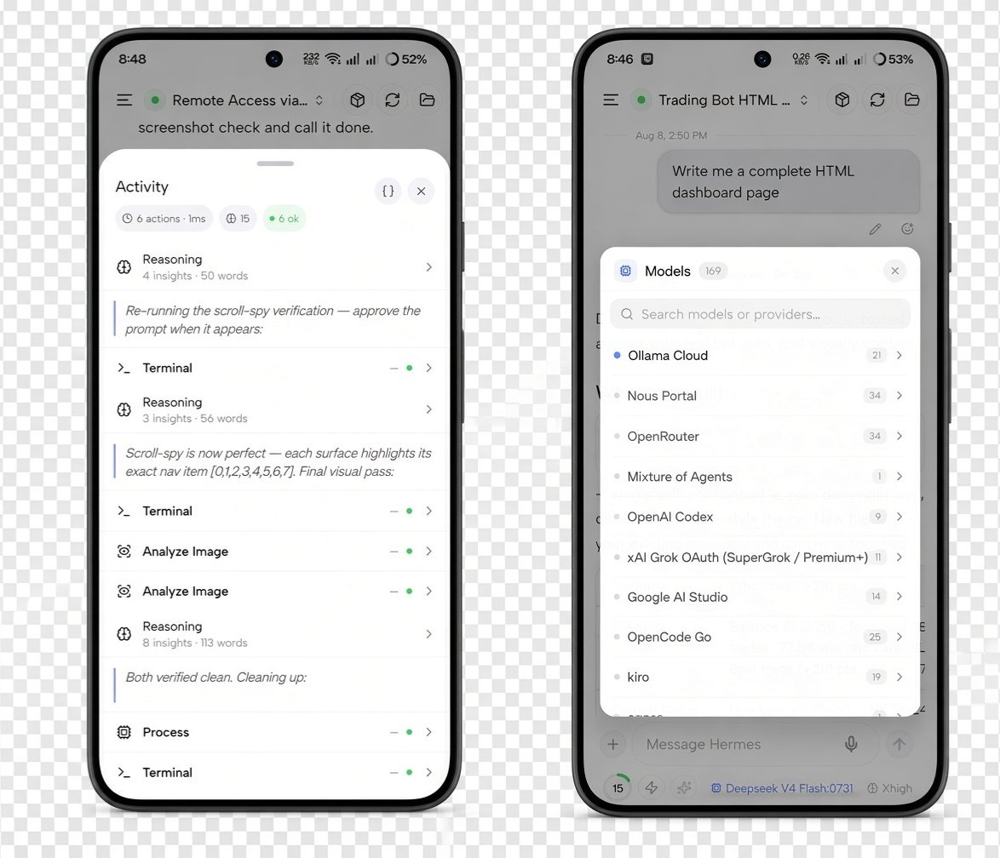
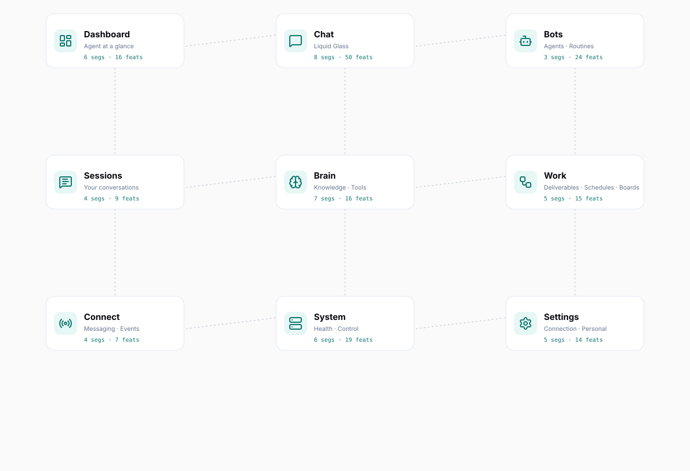

<div align="center">


# Hermes Go

**Your AI agent, in your pocket.**

A native mobile client for your [Hermes Agent](https://hermes-agent.nousresearch.com). For self-hosted setups, one prompt configures basic auth, binds port 9119, detects Tailscale, and hands you your connection details. Hermes Cloud connects through its portal.

**Bots Mode** brings named AI teammates to your phone — use desktop-style `@` handoff from any chat, keep each teammate’s conversation isolated, hide agents from the roster, schedule routines, choose from 16 themes, and connect custom endpoints.

`v1.0.14` · Android APK · Closed Source · Zero Telemetry

[](https://github.com/shilp26/hermes-go/releases)

</div>

---

## What is Hermes Go?

Hermes Go is a **native Android client** for Hermes Agent — self-hosted or Hermes Cloud. It is not a chat wrapper — it is the full agent in your hand:

- **Live streaming** — reasoning rows, tool timelines, and markdown as they happen
- **Voice** — dictate, hear replies, hands-free conversation loop
- **Artifacts** — images, audio, and HTML previews inline in chat
- **Full control** — approvals, sudo, secrets, queue, steer, stop
- **Deep visibility** — health, analytics, logs, ops console, config editor
- **Your server, your data** — connects direct to your server over LAN or Tailscale, or via Hermes Cloud for portal-managed agents

> **Closed source.** The app is distributed as a signed APK. No telemetry, no analytics, no tracking. Self-hosted connections go directly to your server; Hermes Cloud connections use Hermes Cloud.

> 💙 **Built on [Hermes Agent](https://github.com/NousResearch/hermes-agent) by [Nous Research](https://nousresearch.com/) — thank you for making this possible!**

---

## Screenshots

<p align="center">
  
</p>

| Sessions | Dashboard & Settings | Drawer |
|---|---|---|
|  |  |  |

| Session sheets | Context & Artifacts | Activity & Models |
|---|---|---|
|  |  |  |

---

## App Map

<p align="center">
  
</p>

### Surfaces

| | Surface | Segments | Features | What it does |
|---|---|---|---|---|
|  | **Dashboard** | 6 | 16 | Agent status, performance, capabilities, alerts, quick compose, profile switcher |
|  | **Chat** | 8 | 50 | Live streaming, voice, media & artifacts, approvals, queue & steer, subagents, share from other apps, composer tools |
|  | **Bots** | 2 | 18 | Agents, Bot Chat, @-assign handoff, assignment receipts, avatars, hidden roster, Star Map, routines |
|  | **Sessions** | 4 | 9 | Inbox, folders & projects, full-text search, bulk management |
|  | **Brain** | 7 | 16 | Models, skills, tools, memory, Star Map, MCP, plugins |
|  | **Work** | 5 | 15 | Artifacts browser, cron jobs, kanban board, host files, processes |
|  | **Connect** | 4 | 7 | Channel status, webhook routes, pairing, Hermes Cloud |
|  | **System** | 6 | 17 | Health, analytics, setup, ops console, logs, power tools |
|  | **Settings** | 5 | 9 | Servers, connection, appearance, profile, feedback & info |

**Total: 9 surfaces · 47 segments · 162 features**

> Full interactive map: [App Map — Hermes Go](https://shilp26.github.io/hermes-go/app-map.html)

---

## Getting Started

### 1. Download the APK

[Download Hermes Go v1.0.14](https://github.com/shilp26/hermes-go/releases/tag/v1.0.0) (76 MB)

**Verify the download** — the SHA-256 of the published APK is:

```
2188b21b164b9fdcd0991c634772d1083227197b31c27173d472a2b19d1da3a1
```

```bash
# Linux / macOS
sha256sum HermesGo.apk

# Windows (PowerShell)
Get-FileHash HermesGo.apk -Algorithm SHA256
```

If the hash matches, the file is exactly what we published — nothing added, nothing removed.

### 2. Install

1. Open the downloaded `HermesGo.apk` on your Android device
2. If prompted, allow **"Install unknown apps"** for your browser or file manager
3. Tap **Install**
4. Open **Hermes Go**

> A Play Store release is planned.

### 3. Connect to your agent

1. Open Hermes Go
2. **Self-hosted** — enter your agent's address (`http://<host>:9119` on your LAN, your Tailscale IP, or `https://your-domain` behind a TLS reverse proxy) and your basic-auth credentials (set during `hermes-agent` setup)
3. **Hermes Cloud** — sign in from the Connect screen with your portal account, pick your org and agent
4. Done — the full agent is in your hand

---

## Key Features

### 🗨️ Chat — Liquid Glass
- Live streaming with reasoning rows and tool timelines
- Markdown, tables, syntax-highlighted code blocks with copy
- Context ring showing live context-window usage
- Inline media: images (full-screen viewer), audio playback, HTML/SVG live previews
- Approvals: approve/deny, clarify, sudo, secret prompts
- Send queue, mid-run steering, clean stop
- Subagent lists with live delegation, async task cards
- Composer: attachments, `/` skills, `@` mentions, prompt improve, YOLO mode, todo status
- **Share from other apps** — send images, PDFs, Word/Excel files, text, or links straight into a chat
- **Background job control** — inspect output, stop, or dismiss running host processes from the chat meta row
- **Tool timing** — per-tool elapsed time remains accurate after background recovery and history rehydration
- **Fast lane** — toggle priority processing on supported models, with Use Fast or Standard choice on pick
- **Reasoning effort** — set Off → Ultra per session and as a profile default
- **Session loops** — recurring `/loop` cards with countdown, status, pause, resume, and stop controls
- **Activity stack** — keep todos, subagents, and loops organized above the composer
- **Persistent task plans** — unfinished work stays visible across turns
- **Recovered prompts** — approvals and clarify prompts return after reconnect
- **Readable tool cards** — key-values, chips, lists, and markdown instead of raw output
- **Technical Activity view** — switch to raw JSON when you need the underlying tool payload
- **Batch clarify** — answer several questions in one card with multi-select, Other, Confirm, and Skip
- **Collapsible details** — HTML `<details>` / `<summary>` sections work like the desktop client while code fences stay untouched
- **Assign with @ from any session** — choose one or several teammates, keep chatting, and receive their replies back in the current conversation
- **Desktop-style handoff** — assignments travel through the current agent while the specialist keeps its own Bot Chat
- **Voice & Home assign** — voice dictation and Home sends use the same desktop-style handoff as typed @mentions

### 🤖 Bots Mode
- **Agents hub** — create or clone named AI teammates with their own chat, memory, skills, toolsets, model, reasoning effort, Fast mode, and SOUL
- **Bot Chat** — one canonical conversation per teammate, kept out of normal Sessions recents; scratch chats remain separate
- **Agent identity** — live faces, optional photo avatars, handles, last-active previews, unread dots, Default/In Chat status
- **Roster controls** — hide agents without disabling mentions or routines; reveal hidden agents with unread indicators
- **Bot avatars** — choose a face, upload a photo, or generate an image
- **Bot details** — edit profile, skills, tools, MCP, SOUL, model, Star Map scope, chats, and routines from one sheet
- **Blob Studio** — customize bot avatars with live Blobatar faces, shapes, colors, and pose controls
- **Working pill** — pulsing status indicator when a bot has a live task
- **Bot chats** — manage Forever Bot Chat, scratch chats, hidden chats, and deletion from Details
- **Forever /new** — compact the canonical Bot Chat instead of resetting it; use New chat for throwaways
- **Bot-scoped Star Map** — open the selected teammate’s learning graph from Details
- **@-assign** — ask a teammate from any chat or Home; multi-agent chips, live Asking/Waiting/Replied receipts, and returned markdown in place
- **Routines** — schedule agent-owned work daily, at intervals, or once; pause, resume, run, inspect history, or delete

### 🗂️ Sessions
- **Action sheets** — long-press actions show icons for star, folder, read/unread, rename, archive, and delete

### 🎙️ Voice
- Hold-to-dictate with STT
- Read any reply aloud (TTS)
- Hands-free conversation loop: listen → think → speak
- Inline audio playback for TTS tool output
- **Expanded composer** — long drafts open into a full-screen editor with model/effort, chips, and send
- **Paste collapse** — large pastes, code fences, and stack traces auto-collapse into snippet attachments

### 📦 Artifacts
- Every media item from a session, searchable
- Full-screen image viewer with pinch-zoom
- Offline-first browsing from cached session media

### 🧠 Brain
- Model provider catalog with fallback chain and effort control
- **Custom endpoints** — add, edit, and delete OpenAI-compatible providers (Ollama, vLLM, LM Studio) with server-side API keys
- Skills with enable toggles — **open and edit skills** from the Skills hub or skill tool cards
- Toolsets with environment configuration
- Memory block viewer/editor
- **Star Map** — interactive learning graph: constellation, clusters, timeline, node editor, curator
- MCP server connections
- Plugin toggles

### 📋 Work
- Artifacts browser (images, audio, files)
- Cron jobs: list, run-now, status badges, and clear scheduled-fire errors
- Kanban board with live updates — **request review** from ready or running tasks
- **Host files** — browse the agent filesystem, drop `@file` / `@folder` chips into the composer
- **Processes** — manage background jobs from live sessions, filter and start/stop with confirmation

### 🔌 Connect
- Channel status (Telegram, Discord, Slack) with live dots
- Webhook routes
- Pairing requests + QR provisioning
- **Hermes Cloud** — portal sign-in, org and agent pick, cookie-based reconnect

### 🖥️ System
- Health: host gauges, gateway status
- **Memory and disk pressure alerts** — advisory notices on Home and Health when the host reports elevated pressure
- Analytics: usage trends
- Setup: app features, voice, thinking depth, safety, UI
- **Onboarding setup prompt** — collapse or expand the full prompt, then copy it
- Ops console with readable parsed output
- Live log stream with pause-on-scroll
- Power tools: config editor, environment, OAuth, profiles, files, credentials

### ⚙️ Settings
- Multi-server with URL switching
- Connection details + Tailscale detection
- **Custom endpoints** — manage OpenAI-compatible providers from Brain → Models
- **Theme gallery** — 16 WCAG-minded presets with live preview, System/Dark/Light filters, and separate dark & light defaults
- **Theme reset** — restore Obsidian Teal / Titanium Frost; choices persist
- Active profile with a display nickname for the default profile
- **Feedback** — submit a bug, feature idea, improvement, or question with screenshots and status tracking
- **What's New** — release notes in-app, product version in the footer
- **Backup preview** — see exactly what a prefs restore brings back before accepting
- **Feature map** — search every screen, jump by area, tap to go straight to a feature

---

## Security & Trust

| Property | Value |
|---|---|
| **Distribution** | Signed APK via GitHub Releases |
| **Telemetry** | **None.** Zero analytics, zero tracking |
| **Data path** | Direct to your server (LAN / Tailscale) or Hermes Cloud — no telemetry either way |
| **Auth** | Basic auth (self-hosted) or Hermes Cloud portal sign-in |
| **Secrets** | Stored in platform secure storage (expo-secure-store) |
| **Source** | Closed source — the APK is the artifact of record |
| **Verification** | SHA-256 published with every release |

---

## Tech Stack

| Layer | Technology |
|---|---|
| Framework | [Expo](https://expo.dev) SDK 56 · React Native 0.85 |
| Navigation | expo-router (typed routes) |
| State | Zustand 5 |
| Persistence | expo-sqlite (local-first, background sync) |
| Real-time | WebSocket JSON-RPC gateway client |
| Cloud | Hermes Cloud portal (org & agent pick, cookie reconnect) |
| Voice | STT dictation + TTS playback |
| Icons | lucide-react-native |
| Build | EAS Build (APK) + OTA updates (expo-updates) |

---

## Architecture

```
┌─────────────────────────────────────────────┐
│                 Hermes Go (Android)          │
├──────────────┬──────────────────────────────┤
│  UI Layer    │  Drawer rail · 9 surfaces    │
│  State       │  Zustand stores (sync-aware) │
│  Persistence │  SQLite · background sync    │
│  Transport   │  WebSocket JSON-RPC client   │
│  Auth        │  Basic auth · secure store   │
└──────────────┴──────────────────────────────┘
        │                        │
        │  WebSocket (JSON-RPC)  │  Hermes Cloud (portal
        │  / REST                │  sign-in · org & agent
        ▼                        ▼  pick · cookie reconnect)
┌──────────────────┐  ┌───────────────────────┐
│ Your self-hosted │  │    Hermes Cloud       │
│   Hermes Agent   │  │      agents           │
│ (port 9119 · LAN │  │  (portal-managed)     │
│  or Tailscale)   │  │                       │
└──────────────────┘  └───────────────────────┘
```

---

## Changelog

See [CHANGELOG.md](CHANGELOG.md) for the full release history.

---

## License

**This repository (the website) is open source** under the [MIT License](LICENSE). The Hermes Go application itself is **closed source** — distributed as a signed APK with a published SHA-256 for verification. The APK is provided for personal use; redistribution or modification of the binary is not permitted without written consent.

© 2026 Hermes Go by Shilp
