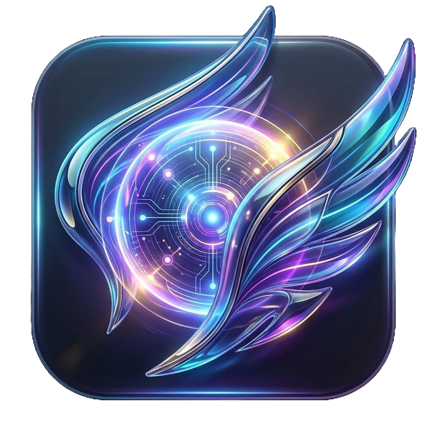
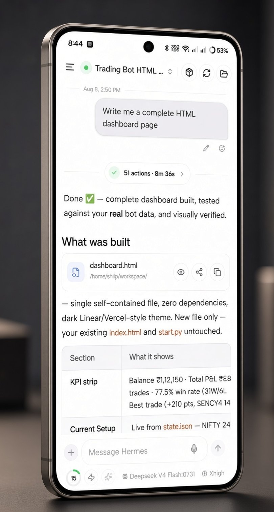
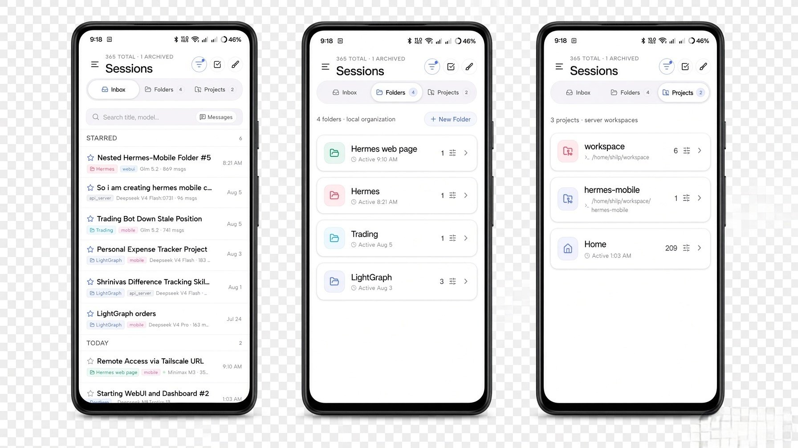
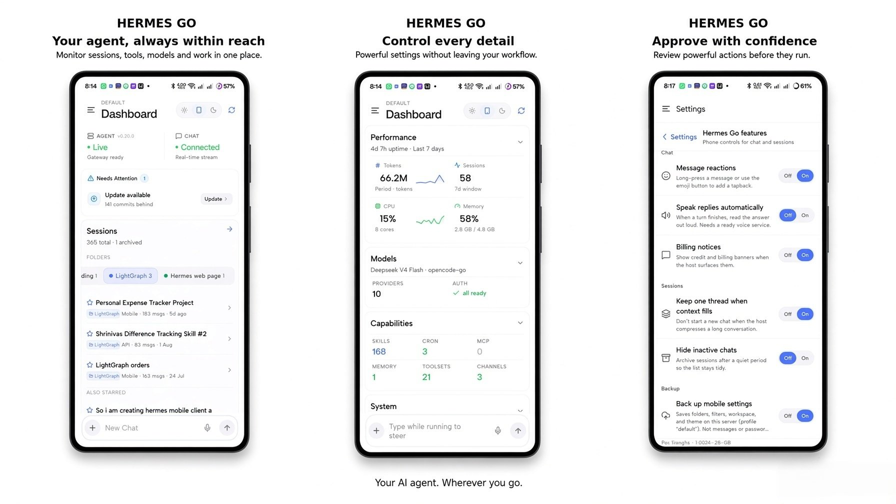
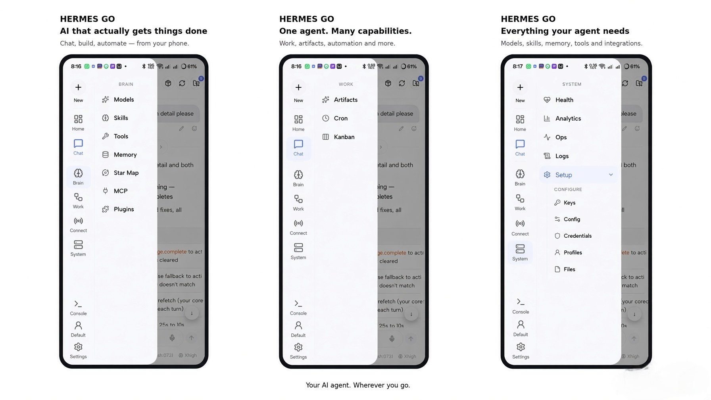
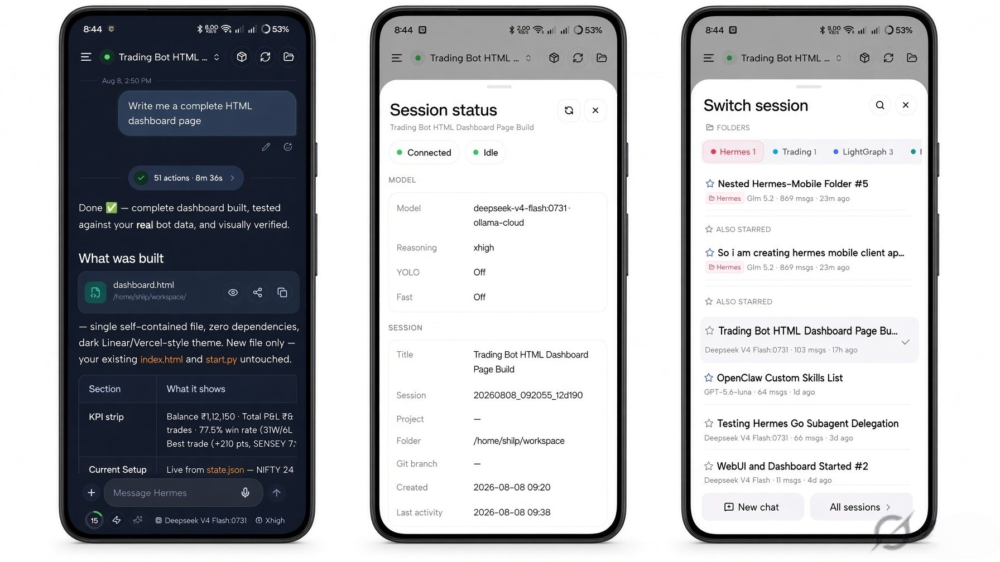
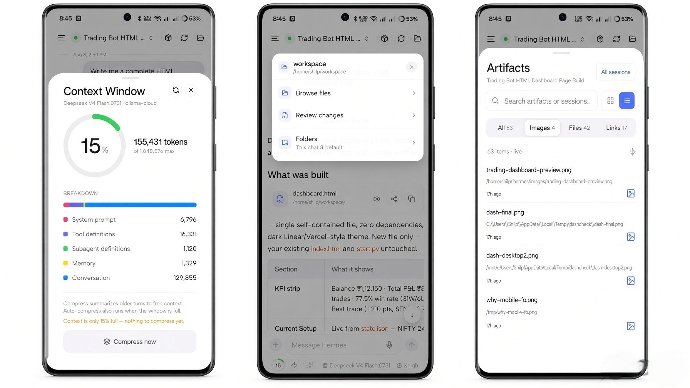
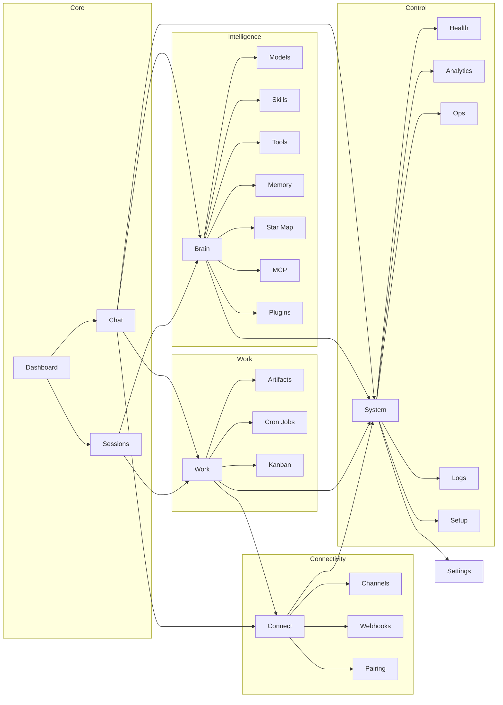

<div align="center">



# Hermes Go

**Your AI agent, in your pocket.**

The official native mobile client for your self-hosted [Hermes Agent](https://hermes-agent.nousresearch.com). One prompt configures basic auth, binds port 9119, detects Tailscale, and hands you your connection details.

`v1.0.0` · Android APK · Closed Source · Zero Telemetry

</div>

---

## What is Hermes Go?

Hermes Go is a **native Android client** for the self-hosted Hermes AI agent. It is not a chat wrapper — it is the full agent in your hand:

- **Live streaming** — reasoning rows, tool timelines, and markdown as they happen
- **Voice** — dictate, hear replies, hands-free conversation loop
- **Artifacts** — images, audio, and HTML previews inline in chat
- **Full control** — approvals, sudo, secrets, queue, steer, stop
- **Deep visibility** — health, analytics, logs, ops console, config editor
- **Your server, your data** — connects over LAN or Tailscale, never through a cloud relay

> **Closed source.** The app is distributed as a signed APK. No telemetry, no analytics, no tracking. Your conversations stay on your machine.

---

## Screenshots

| Chat | Sessions | Dashboard |
|---|---|---|
|  |  |  |

| Drawer | Session sheets | Artifacts |
|---|---|---|
|  |  |  |

---

## App Map



### Surfaces

| Surface | Segments | Features | What it does |
|---|---|---|---|
| **Dashboard** | 6 | 12 | Agent status, performance, capabilities, alerts, quick compose, profile switcher |
| **Chat** | 7 | 33 | Live streaming, voice, media & artifacts, approvals, queue & steer, subagents, composer tools |
| **Sessions** | 4 | 9 | Inbox, folders & projects, full-text search, bulk management |
| **Brain** | 7 | 14 | Models, skills, tools, memory, Star Map, MCP, plugins |
| **Work** | 3 | 7 | Artifacts browser, cron jobs, kanban board |
| **Connect** | 3 | 3 | Channels, webhooks, pairing |
| **System** | 6 | 16 | Health, analytics, setup, ops console, logs, power tools |
| **Settings** | 4 | 7 | Servers, connection, appearance, profile |

**Total: 8 surfaces · 40 segments · 101 features**

> Full interactive map: [app-map.html](app-map.html)

---

## Getting Started

### 1. Download the APK

[Download Hermes Go v1.0.0](https://github.com/shilp26/hermes-go/releases/tag/v1.0.0) (170 MB)

**Verify the download** — the SHA-256 of the official APK is:

```
342b6ef2a6b41c5299e943f7f33ce7fb96d4adeb08179921493cbbc388bdd899
```

```bash
# Linux / macOS
sha256sum HermesGo.apk

# Windows (PowerShell)
Get-FileHash HermesGo.apk -Algorithm SHA256
```

If the hash matches, the file is exactly what we published — nothing added, nothing removed.

### 2. Install

1. Open the downloaded `HermesGo.apk` on your Android device
2. If prompted, allow **"Install unknown apps"** for your browser or file manager
3. Tap **Install**
4. Open **Hermes Go**

> **Why sideload?** The APK is distributed directly — no Play Store review queue. The SHA-256 above is your guarantee of authenticity. A Play Store release is planned.

### 3. Connect to your agent

1. Open Hermes Go
2. Enter your agent's address — `http://<host>:9119` on your LAN, or your Tailscale IP
3. Enter your basic-auth credentials (set during `hermes-agent` setup)
4. Done — the full agent is in your hand

---

## Key Features

### 🗨️ Chat — Liquid Glass
- Live streaming with reasoning rows and tool timelines
- Markdown, tables, syntax-highlighted code blocks with copy
- Context ring showing live context-window usage
- Inline media: images (full-screen viewer), audio playback, HTML/SVG live previews
- Approvals: approve/deny, clarify, sudo, secret prompts
- Send queue, mid-run steering, clean stop
- Subagent lists with live delegation, async task cards
- Composer: attachments, `/` skills, `@` mentions, prompt improve, YOLO mode, todo status

### 🎙️ Voice
- Hold-to-dictate with STT
- Read any reply aloud (TTS)
- Hands-free conversation loop: listen → think → speak
- Inline audio playback for TTS tool output

### 📦 Artifacts
- Every media item from a session, searchable
- Full-screen image viewer with pinch-zoom
- Offline-first browsing from cached session media

### 🧠 Brain
- Model provider catalog with fallback chain and effort control
- Skills with enable toggles
- Toolsets with environment configuration
- Memory block viewer/editor
- **Star Map** — interactive learning graph: constellation, clusters, timeline, node editor, curator
- MCP server connections
- Plugin toggles

### 📋 Work
- Artifacts browser (images, audio, files)
- Cron jobs: list, run-now, status badges
- Kanban board with live updates

### 🔌 Connect
- Channel status (Telegram, Discord, Slack) with live dots
- Webhook routes
- Pairing requests + QR provisioning

### 🖥️ System
- Health: host gauges, gateway status
- Analytics: usage trends
- Setup: app features, voice, thinking depth, safety, UI
- Ops console with readable parsed output
- Live log stream with pause-on-scroll
- Power tools: config editor, environment, OAuth, profiles, files, credentials

### ⚙️ Settings
- Multi-server with URL switching
- Connection details + Tailscale detection
- Theme (dark/light)
- Active profile

---

## Security & Trust

| Property | Value |
|---|---|
| **Distribution** | Signed APK via GitHub Releases |
| **Telemetry** | **None.** Zero analytics, zero tracking |
| **Data path** | Direct to your server (LAN / Tailscale) — no cloud relay |
| **Auth** | Basic auth against your self-hosted agent |
| **Secrets** | Stored in platform secure storage (expo-secure-store) |
| **Source** | Closed source — the APK is the artifact of record |
| **Verification** | SHA-256 published with every release |

---

## Tech Stack

| Layer | Technology |
|---|---|
| Framework | [Expo](https://expo.dev) SDK 56 · React Native 0.85 |
| Navigation | expo-router (typed routes) |
| State | Zustand 5 |
| Persistence | expo-sqlite (local-first, background sync) |
| Real-time | WebSocket JSON-RPC gateway client |
| Voice | STT dictation + TTS playback |
| Icons | lucide-react-native |
| Build | EAS Build (APK) + OTA updates (expo-updates) |

---

## Architecture

```
┌─────────────────────────────────────────────┐
│                 Hermes Go (Android)          │
├──────────────┬──────────────────────────────┤
│  UI Layer    │  Drawer rail · 8 surfaces    │
│  State       │  Zustand stores (sync-aware) │
│  Persistence │  SQLite · background sync    │
│  Transport   │  WebSocket JSON-RPC client   │
│  Auth        │  Basic auth · secure store   │
└──────────────┴──────────────────────────────┘
        │  WebSocket (JSON-RPC) / REST
        ▼
┌─────────────────────────────────────────────┐
│        Your self-hosted Hermes Agent        │
│        (port 9119 · LAN or Tailscale)       │
└─────────────────────────────────────────────┘
```

---

## Changelog

See [CHANGELOG.md](CHANGELOG.md) for the full release history.

---

## Roadmap

- [ ] **Android widget** — quick actions (new chat, voice, starred) from the home screen
- [ ] **Share to Hermes** — send text, images, and PDFs from other apps into a chat
- [ ] Google Play Store release
- [ ] iOS build
- [ ] More channel integrations

---

## License

**This repository (the website) is open source.** The Hermes Go application itself is **closed source** — distributed as a signed APK with a published SHA-256 for verification. The APK is provided for personal use; redistribution or modification of the binary is not permitted without written consent.

© 2026 Hermes AI Ecosystem
